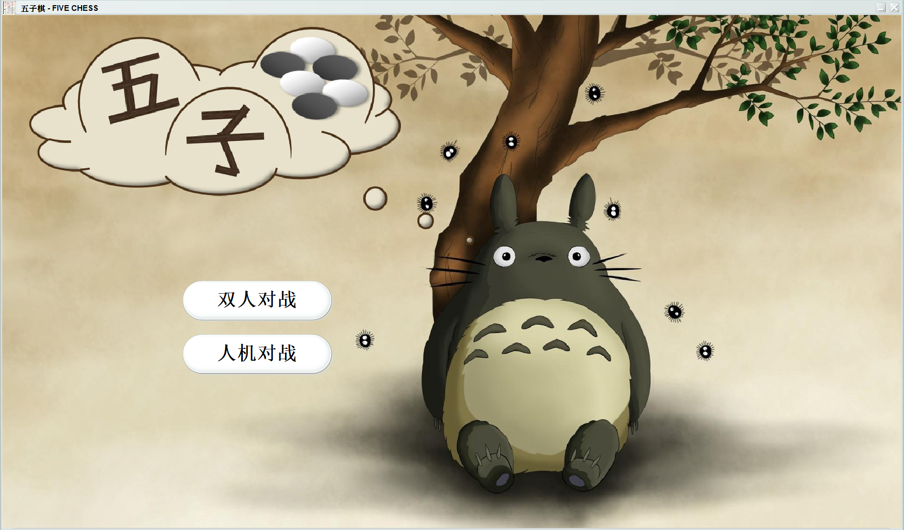
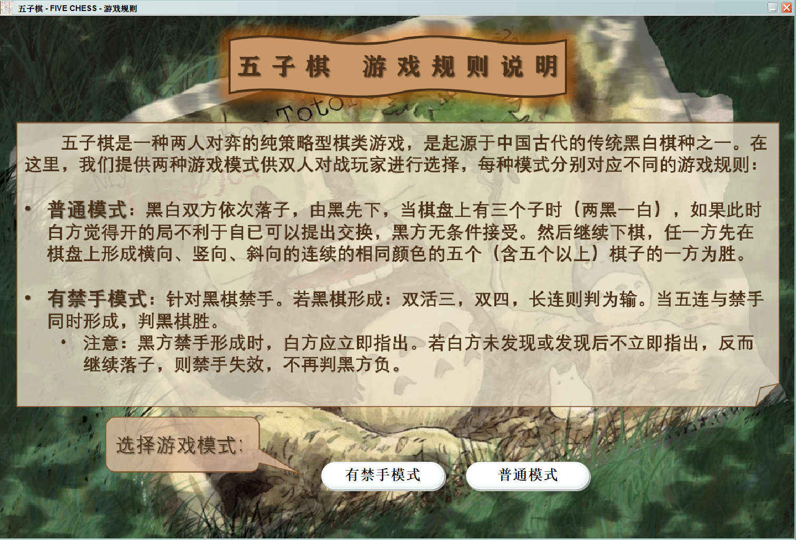
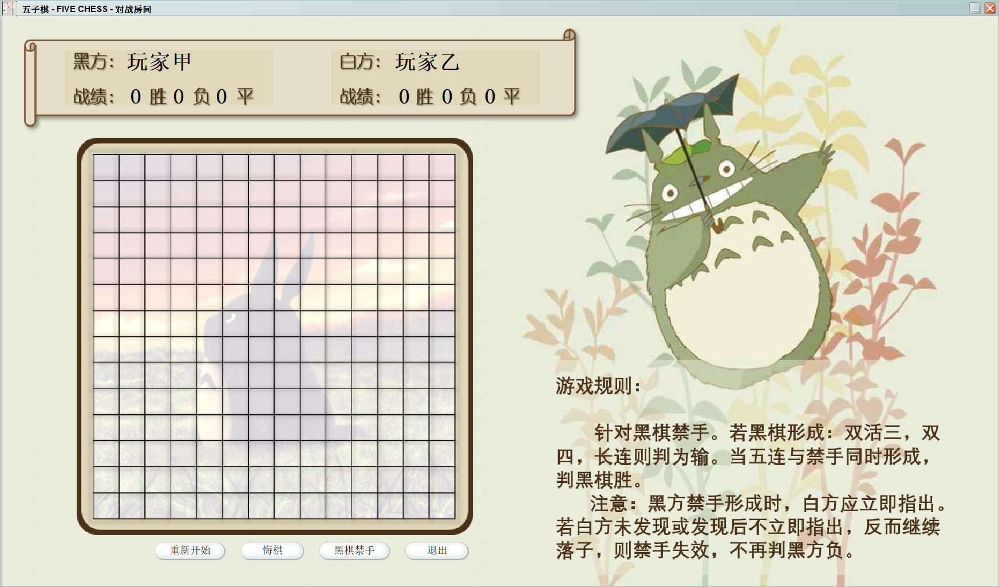
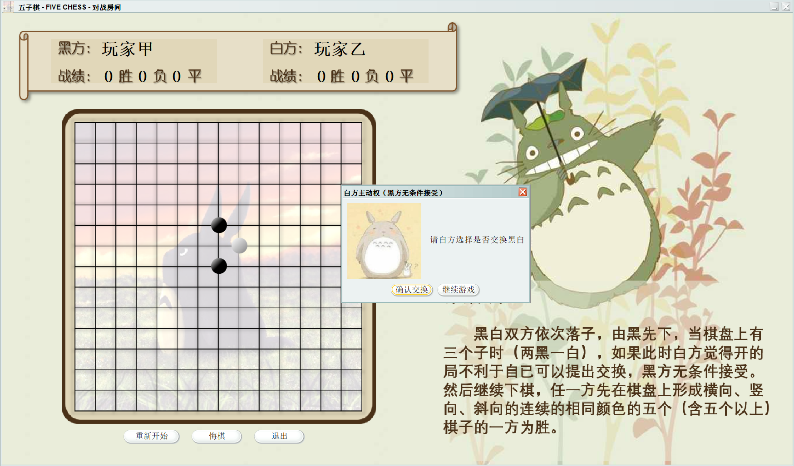
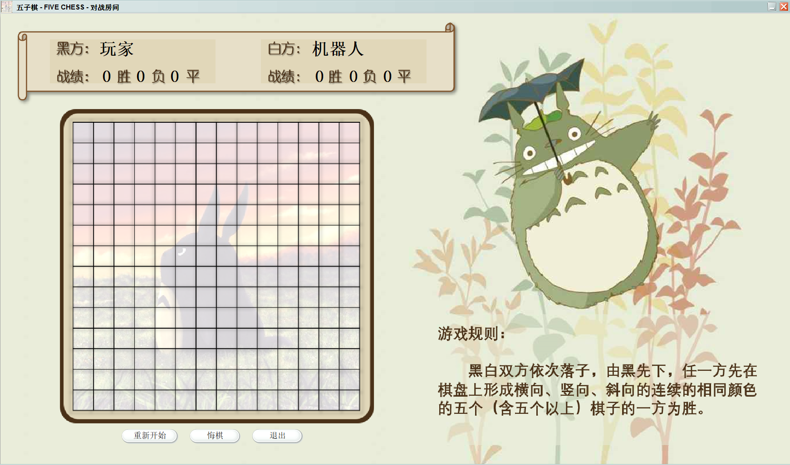

# FiveChess

simple implementation of the game FiveChess

#### Home Page

We provide two options of the game mode: `Two-Players` / `Single-Player`

#### Rule Page

If choosing `Two-Players` mode, we provide two options for the rule mode: `forbid-hand` / `normal`

#### Room Page

Below is an example of the room page in `forbid-hand` & `Two-Players` mode. The White needs to make her own judgement on whether the Black is forbidden. 

If it's `normal` mode, when the global steps turns to 3 (2 black 1 white), the White needs to choose whether to switch identities.

If it's `Single-Player` mode, ths White is set as the Robot we developed, and the rule is the most primary here, _i.e._ no switch & no forbidden.

